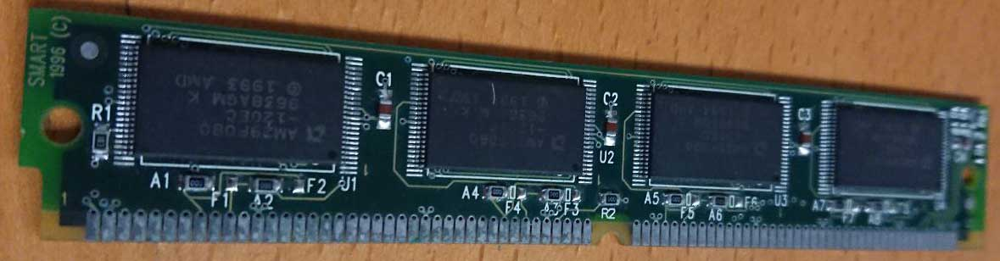
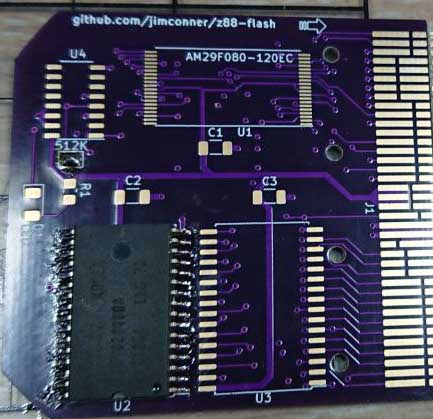
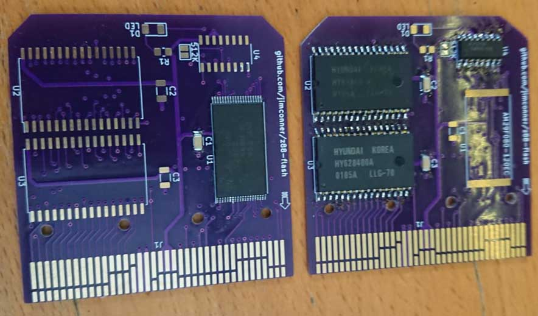
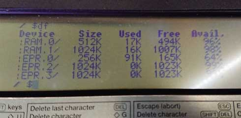
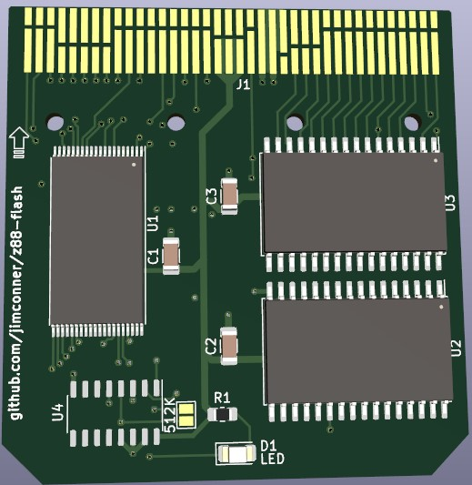
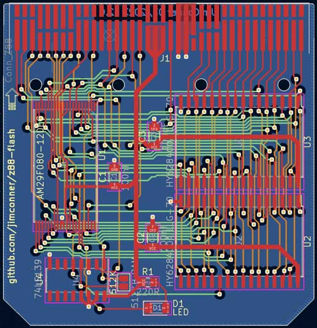

# z88-flash

An open-source expansion card for the Cambridge Z88 which can be configured as 512KB RAM, 1MB RAM or 1MB Flash.

This work is based upon the Z88 connector design shared by XavSnap at [SinclairZXWorld Z88 Forum](https://sinclairzxworld.com/viewtopic.php?f=24&t=4431) - Thank you XavSnap!

I found that I had 4 x AM29F080 (1MBit * 8) Flash memory chips on a stick which came out of a Cisco router in the 1990s. This chip is reported to be compatbile with the Cambridge Z88, so as a fun project I decided that I'd use one of the cheap PCB manufacturing services and make myself some Flash expansion cards.

The first revision of this board was only designed to support 1MB Flash, but upon receiving the first set of PCBs, it was discovered that XavSnap's design was using 1.27mm pin pitch whereas the Z88 uses 1.25. During the redesign support was added for using either one or two 512KB SRAM chips instead of Flash. The PCB can now support either 1x1MB Flash, 1x 512KB SRAM or 2x512KB SRAM (74139 required)

* To use with 512KB SRAM (HY628400A or AS6C4008), populate C2 and U2 and short the 512K solder jumper. (C2 is not populated in the photo below because I was mid-way through building)

* To use with 1MB Flash populate only U1(AM29F080) and C1(100nF)
* To use with 1MB SRAM populate C2 & C3(100nF), U2 & U3(HY628400A or AS6C4008) and U4(74139)

* The SRAM configurations of the board and hand-solderable, for for the flash chip it's a lot easier to use solder paste and hot air.
* You may optionally populate R1 and D1 with a 220Ohm resistor and an LED to gain a 'Writing' status LED.

If you're looking for a one-off I'd recommend purchasing Rakewell's reasonably priced bare PCB, but I was more looking for a fun project. I also wanted a solder paste stencil for hot air reflow soldering which Rakewell do not provide. A batch of 5 PCBs from Shenzen, with gold plating, solder stencil and the cheapest shipping cost a little over £30 (in 2023).

If you do decide to make this, do not underestimate the importance of the plastic case which holds the card. I struggled initially with 3D Printed cases, but discovered that the slighets warp in the print, or lack of pressure holding the card tightly in place causes a lot of problems. I'd recommend disassembling and reusing an existing card case for your first attempt, and wrapping a single layer of tape around it to ensure that the connector edge is clamped to the back shell firmly. Only once you're confident that a PCB is working correclty should you think about putting it in a printed case.

Unfortunately the slik-screen on the PCB doesn't clearly show the pin1 markings, so check the 3D board picture below, the photos above open the PCB design with KiCAD to be absolutely certain you've got it correct. The Flash chip has pin1 facing towards the edge connector, the ram chips have pin1 at the edge of the PCB and the 74139 is the same orientation as the RAM chips.

* With this much memory, you can have every piece of software ever written for the Z88 both stored on Flash, and running in RAM... with enough space remaining to do it all over again.

I've tested all three configurations of this design with my Z88 successfully, but haven't tested adding a status LED - I don't anticipate any problems with that - I just didn't have any surface mount LEDs to use.

I found the component stencil and footprint for the AM29F080 as free downloads at [Ultra Librarian](https://www.ultralibrarian.com/) - I have not included them in this archive as they are almost certianly not licensed for redistribution, but you should be able to sign up for a free account and download a copy.

The 3D printed card case availabile from Thingverse does not quite fit the standard z88 card design, and you need to sand down the chamfered corners on the PCBs a little to make it fit - With a pre-made case it'll fit fine. It has been noted that the placement of the LED in the centre of the board makes adding a label to the card problematic, so if you're planning on making any refinements to the board, that could be worthwhile tweak.

If you're just looking to order PCBs without making any modifications then the `Z88_1MB_Flash.zip` file contains all of the gerbers and drill files you need to upload. You should just need to upload the file and hit 'order-pcb' at your preferred manufacturer.

This project is released as an Open Source Hardware offering. Do with it whatever you will, but don't blame me if things go wrong.
